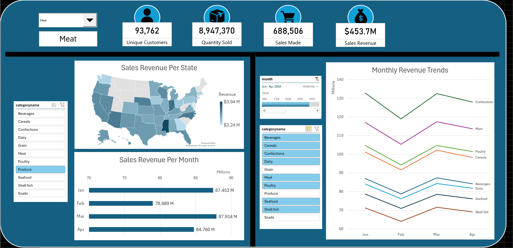

# Dashboard Download

[Link to Dashboard - Download as a Microsoft Excel file](https://docs.google.com/spreadsheets/d/1fZysBvT_tXFhDFi8x9rsho4mbsDy7Xns/edit?usp=sharing&ouid=115637583297727484475&rtpof=true&sd=true)

---

# Overview

The purpose of this project is to analyze a relational database of grocery sales to create an interactive business intelligence dashboard. It follows an end-to-end workflow starting from data requirements gathering and data collection, followed by data cleaning and preprocessing to ensure consistency and accuracy across the dataset. Once the dataset was curated, exploratory data analysis was performed to identify key patterns in sales performance, customer behaviour, and category distribution. This was complemented with efficient SQL querying and aggregation to support calculated metrics. Finally, the processed data was visualized using pivot tables, KPI cards, slicers, and timelines, resulting in an interactive dashboard for analyzing sales trends, geographic performance, and category-level insights.

---

# Dashboard Preview

---

# Dashboard Features

## KPI Cards
- Unique Customer Count  
- Total Quantity Sold  
- Total Sales Transactions  
- Total Sales Revenue  

All KPI cards are dynamically updated through a Category Name slicer.

---

## Visualizations
- **Sales Revenue Per State** — Geographic revenue distribution with category filtering  
- **Sales Revenue Per Month** — Monthly revenue analysis with category filtering  
- **Monthly Revenue Trends** — Category-level revenue trends over time using category and timeline filters  

---

## Interactive Controls
- Category Name Form Control  
- Category Name Slicer  
- Monthly Timeline Filter  

---

# Repository Contents
- SQL queries used for data aggregation  
- Dashboard KPI and charts overview  
- Insights report

---

## Dataset Source

All analysis in this project is based on the following publicly available dataset:

[Grocery Sales Dataset (Kaggle)](https://www.kaggle.com/datasets/andrexibiza/grocery-sales-dataset)
